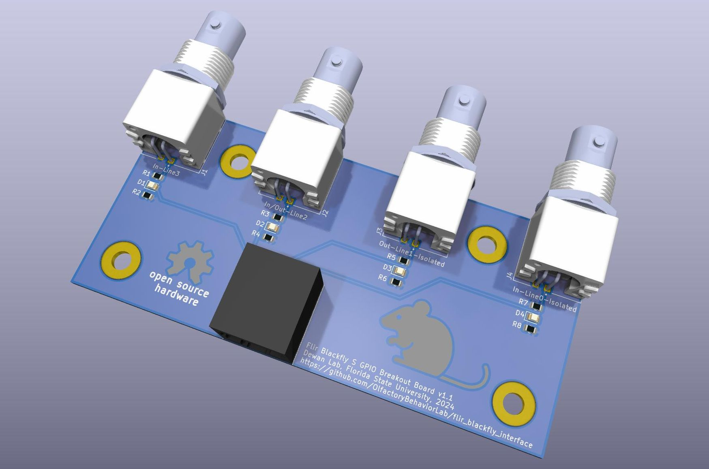

# Flir Blackfly S Interface Board

The Flir Blackfly S series of cameras have a GPIO interface that is exposed via a military-style DIN connector. The FSU Psychology Instrument Development shop generously attached a section of Ethernet cable to the DIN connector. For flexibility, we attached a RJ-45 connector to the opposite end of the cable. Our behavioral controllers expose TTL-level IO via a series of BNC connectors. To facilitate easy connection of our behavioral controller IO to the camera GPIO, we created a small RJ-45 to BNC adapter board.

## Design

The board has a very simple design that connects the RJ-45 pins to the BNC outputs. Two of the GPIO pins are opto-isolated inside the camera. These two GPIO pins and their associated BNC connectors are connected to their own ground plane that returns to the opto-isolated ground connection.

The other two GPIO pins are not opto-isolated and are connected to the power ground of the camera. These two GPIO pins and their associated BNC connectors return via a separate ground plane connected to the power ground.

The board is setup for active **HIGH** inputs. Each input is pulled low using 1k resistors.

Four, M4-sized mounting holes are placed on the board for convenience.

## License

This project is licensed under GNU General Public License v3.0. You can find the included copy of the license [here](LICENSE). For more information about the license and its terms, please visit [SPDX](https://spdx.org/licenses/GPL-3.0-or-later.html)
